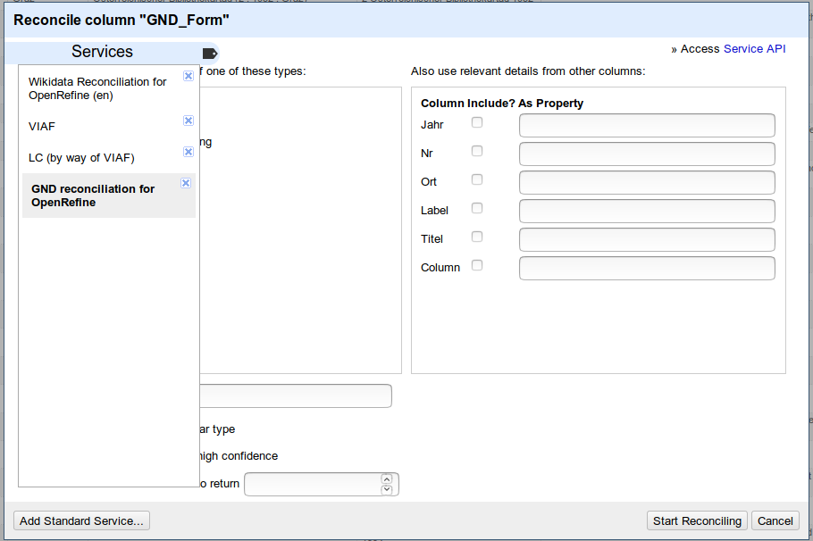
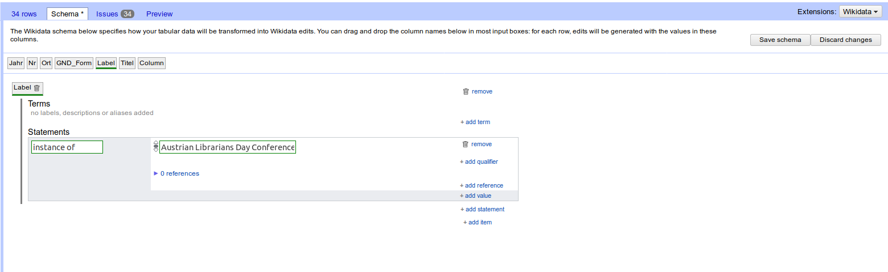

# OpenRefine

Einführung in OpenRefine - Bearbeitung bibliographischer Daten - Reconciliation mit Wikidata und (lobid.org/)GND - Upload nach Wikidata

Workshop, Österreichischer Bibliothek*tag, 12.09.2019

# OpenRefine - Start & Installation

* JAVA-Applikation zur Bearbeitung tabellarischer Daten
* Download und Installation via [www.openrefine.org](http://www.openrefine.org)
* Standardinstallation:
   * Download der Paketdatei
   * Entpacken
   * Starten der Datei `refine`
* Nach Aufruf der Datei `refine` startet OpenRefine in einem Browserfenster mit der lokalen Adresse [http://127.0.0.1:3333](http://127.0.0.1:3333)

# Datensets im Workshop

1. Wikitabelle [Liste Österr. Bibtage](https://de.wikipedia.org/wiki/Liste_der_%C3%96sterreichischen_Bibliothekartage) > [Fertiges OpenRefine Projekt](OeBibTage.openrefine.tar.gz)
1. Spreadsheet [merkur2006.csv](merkur2006.csv)
1. JSON-Import aus OJS-OAI-Export einer ausgewählten Zeitschrift [suburban2019009.json](suburban2019009.json)

# Neuanlage eines Projektes, Import von Daten aus der Zwischenablage

**Use-Case#1: Anlage und Bearbeitung von Wikidata-Items für alle Österreichischen Bibliothekartage auf Basis der [Wikipedia-Liste]((https://de.wikipedia.org/wiki/Liste_der_%C3%96sterreichischen_Bibliothekartage)) inkl. GND-ID**

| {style="float:right; width:500px;" }
* Von der Wikipedia-Seite entweder die gerenderte Tabelle oder den Tabellenquellcode verwenden und einfügen
  * `Create Project` > `Clipboard`
* Preview erstellen lassen - Datenansicht überprüfen
* Projektname vergeben, etw. Tags
* Click Create Project
* Erstellung Label und Description
  * Klick auf Spalte `Edit Column` > `Add column based on this column...`

# Bearbeiten von Inhalten in Spalten

| {style="float:right; width:500px;" }
* Vergabe eines neuen Spaltennamens (außer bei `Edit Cells` > `Transform`)
* Auswahl der Expression-Language (GREL, Python, Clojure)
* Eingabe des Codes
  * Erstellung eines OeBib-Tag-Labels `Nr. Österreichischer Bibliothekartag Jahr` durch Verwendung von Werten in bestehenden Spalten und Stringsa
  * `cells["Nr"].value + " Österreichischer Bibliothekartag " + cells["Jahr"].value`
* **Undo/Redo**
  * Bei Fehlern in Bearbeitungsschritten lässt sich der Bearbeitungsstand auf einen beliebigen Punkt in der Edithistorie zurücksetzen. Klick auf `Undo/Redo` in der linken Navigationsspalte.

# Reconciliation - lobid.org/gnd

| {style="float:right; width:500px;" }
* Die Österr. Bibliothekartage sind in der GND nach folgender Struktur angesetzt: "`Österreichischer Bibliothekartag (Nr : Jahr : Ort)`"
  * Anlage einer neuen Spalte mit Erstellung eines Wertes gemäß der GND-Ansetzung
  * Das Edit/Add by Script-Fenster erhält auch eine `History` wo bereits verwendete Skriptblöcke wieder verwendet werden können.
* Reconciliation 
  * Klick auf Spaltenkopf `Reconcile` > `Start reconciling`
  * Auswahl der Quelle `GND reconciliation for OpenRefine`
  * Sofern möglich - Einschränkung auf bestimmten Entitätstyp (hier: `Konferenz oder Veranstaltung`)
  * Start Reconciling
* GND-ID extrahieren
  * Klick auf reconcilierte Spalte: `Edit Column` > `Add columns from renonciled values` > GND-Nummer auswählen
  * alternativ: GREL-Code `cells["SpaltenName"].recon.match.id`

# Reconciliation - Wikidata

* Um aus OpenRefine Wikidata editieren zu können, müssen die Datensätze gegen Wikidata reconciliert werden.
* Reonciliation funktioniert wie zuvor gegen lobid.org gezeigt.
  * Auswahl der Spalte mit den Werten die zur Reconcilierung maßgeblich verwendet werden soll (Text oder Q-ID)
  * Klick auf Spaltenkopf `Reconcile` > `Start reconciling`, Auswahl `Wikidata Reconciliation for OpenRefine`
  * Einschränkung für bestimmte Typen (zB Human, Articles etc.)
  * Weitere Spalten können zur näheren Bestimmung verwendet werden (Datum, Ortsangaben etc.)

# Wikidata - Edit Schema

| {style="width:800px;" }
* Klick auf Extensions `Wikidata` > `Edit Wikidata schema`
* Neues Item durch Drag'n'Drop der reconcilierten Spalte einfügen
* Termbox (Labels/Descriptions) durch ziehen der Spalten befüllen
* `Add Statement` klicken, Properties auswählen (Eingabe) und Spalten hineinziehen (für reconcilierte Spalten wie zB der Ort, vorher WD-Reconcicliation laufen lassen!)
  * Statements können um Qualifiers und References ergänzt werden. References können in OpenRefine zu verschiedenen Statements kopiert werden.
* [Fertiges Schema](OeBibTage.openrefine.schema.json)

# Links

* [OpenRefine.org](http://www.openrefine.org)
* [Lib-Carpentry OpenRefine-Tutorial](https://librarycarpentry.org/lc-open-refine/)
* [Wikidata:Tools/OpenRefine](https://www.wikidata.org/wiki/Wikidata:Tools/OpenRefine)
* [OpenRefine GitHub-Repository](https://github.com/OpenRefine/) - Idealer (der einzige) Ort fürs Bugtracking zur Software
* [OpenRefine@StackOverflow](https://stackoverflow.com/questions/tagged/openrefine) Regelmäßig kleine Tipps und Tricks auf Stack erklärt.
